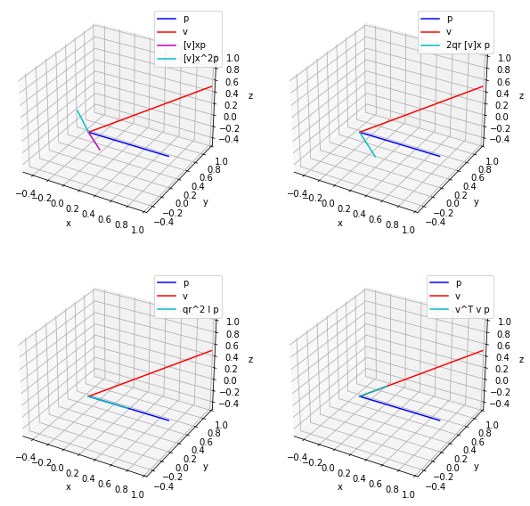
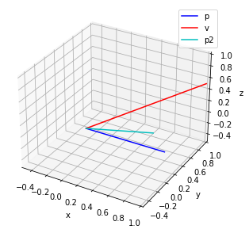

# QuatLib
Quaternion library

# Quaternion
$q = a + bi + cj + dk$

Quaternion can also be represented as scalar and vector parts.

$q = \left(q_r, v \right), v=\left(q_x, q_y, q_z\right)$

## Addition

$q_1 = a_1 + b_1i + c_1j + d_1k$

$q_2 = a_2 + b_2i + c_2j + d_2k$

$q_1 + q_2 = \left(a_1 + a_2\right) + \left(b_1 + b_2\right)i + \left(c_1 + c_2\right)j + \left(d_1 + d_2\right)k$

## Multiplication

### Multiplications of basis elements
* $i1 = 1i = i$
* $j1 = 1j = j$
* $k1 = 1k = k$
* $i^2 = j^2 = k^2 = -1$
* $ij = k, ji = -k$
* $jk = i, kj = -i$
* $ki = j, ik = -j$
* $ikj = -1$

### Multiplication of two quaternions
$q_1 = a_1 + b_1i + c_1j + d_1k$

$q_2 = a_2 + b_2i + c_2j + d_2k$

$q_1 * q_2 = a_1\left( a_2 + b_2i + c_2j + d_2k \right) + b_1i\left( a_2 + b_2i + c_2j + d_2k \right) + c_1j\left( a_2 + b_2i + c_2j + d_2k \right) + d_1k\left( a_2 + b_2i + c_2j + d_2k \right)$

$= a_1a_2 + a_1b_2i + a_1c_2j + a_1d_2k + b_1a_2i - b_1b_2 + b_1c_2k - b_1d_2j + c_1a_2j - c_1b_2k - c_1c_2 + c_1d_2i +d_1a_2k + d_1b_2j - d_1c_2i - d_1d_2$

$= \left( a_1a_2 -b_1b_2 - c_1c_2 - d_1d_2 \right) + \left( a_1b_2 + b_1a_2 + c_1d_2 - d_1c_2 \right)i + \left( a_1c_2 - b_1d_2 + c_1a_2 - d_1b_2 \right)j + \left( a_1d_2 + b_1c_2 - c_1b_2 + d_1a_2 \right)k$

## Rotation

Euclidean vectors $\left(a_x, a_y, a_z\right)$ in $R^{3}$ can be rewritten as $a_x i+a_y j+a_z k$, where $i$, $j$ and $k$ are unit vectors representing the tree Cartesian axes.

A rotation of angle $\theta$ around the axis defined by the unit vector $u = u_{x}i+u_{y}j+u_{z}k$ can be represented by a quaternion using an extension [2] of Euler's formula [3].

$$ e^{ix} = cos x + i sin x $$

$$ q = e^{\frac{\theta}{2}\left(u_xi+u_yj+u_zk\right)} = cos\frac{\theta}{2} + \left(u_xi+u_yj+u_zk\right)sin\frac{\theta}{2} $$

The rotation can be applied to an ordinary vector $p = \left(p_x, p_y, p_z\right) = p_xi+p_yj+p_zk$ in $R^3$ as $p' = qpq^*$, where

$$ q^* = e^{-\frac{\theta}{2}\left(u_xi+u_yj+u_zk\right)} = cos\frac{\theta}{2} - \left(u_xi+u_yj+u_zk\right)sin\frac{\theta}{2} $$

The result of $p' = qpq^*$ is as follows and its the result of Rotate() implemented in [quaternion_operations.h](quaternion_operations.h).

$p' = \left(q_{r} \left(a_{x} q_{r} - a_{y} q_{z} + a_{z} q_{y}\right) + q_{x} \left(a_{x} q_{x} + a_{y} q_{y} + a_{z} q_{z}\right) + q_{y} \left(- a_{x} q_{y} + a_{y} q_{x} + a_{z} q_{r}\right) - q_{z} \left(a_{x} q_{z} + a_{y} q_{r} - a_{z} q_{x}\right)\right) i +$

$\left(q_{r} \left(a_{x} q_{z} + a_{y} q_{r} - a_{z} q_{x}\right) - q_{x} \left(- a_{x} q_{y} + a_{y} q_{x} + a_{z} q_{r}\right) + q_{y} \left(a_{x} q_{x} + a_{y} q_{y} + a_{z} q_{z}\right) + q_{z} \left(a_{x} q_{r} - a_{y} q_{z} + a_{z} q_{y}\right)\right)j +$

$\left(q_{r} \left(- a_{x} q_{y} + a_{y} q_{x} + a_{z} q_{r}\right) + q_{x} \left(a_{x} q_{z} + a_{y} q_{r} - a_{z} q_{x}\right) - q_{y} \left(a_{x} q_{r} - a_{y} q_{z} + a_{z} q_{y}\right) + q_{z} \left(a_{x} q_{x} + a_{y} q_{y} + a_{z} q_{z}\right)\right)k$

Note that the real part is zeroed out during the computation.

### Quaternion-derived rotation matrix
Rotation matrix for $q = q_r + q_xi + q_yj + q_zk$ is derived by using sympy in [quaternion.ipynb](quaternion.ipynb).

$$ R = \begin{bmatrix}q_r^{2} + q_x^{2} - q_y^{2} - q_z^{2} & - 2 q_r q_z + 2 q_x q_y & 2 q_r q_y + 2 q_x q_z \\\\2 q_r q_z + 2 q_x q_y & q_r^{2} - q_x^{2} + q_y^{2} - q_z^{2} & - 2 q_r q_x + 2 q_y q_z \\\\- 2 q_r q_y + 2 q_x q_z & 2 q_r q_x + 2 q_y q_z & q_r^{2} - q_x^{2} - q_y^{2} + q_z^{2}\end{bmatrix} $$

If $q$ is pure rotation, $\lVert q\rVert = q_r^2 + q_x^2+q_y^2 + q_z^2 = 1$

Therefore the rotation matrix can be rewritten as 

$$R = \begin{bmatrix}1 - 2\left(q_y^{2} + q_z^{2}\right) & 2 \left( q_x q_y - q_r q_z\right) & 2\left( q_r q_y + q_x q_z\right) \\\\ 
2\left( q_r q_z + q_x q_y\right) & 1 - 2\left(q_x^{2} + q_z^{2}\right) & 2\left(q_y q_z - q_r q_x\right) \\\\
 2\left( q_x q_z - q_r q_y\right) & 2\left( q_r q_x + q_y q_z \right) & 1 - 2\left( q_x^{2} + q_y^{2}\right) \end{bmatrix}$$

The matrix is the result of ToRotationMatrix() implemented in [quaternion_operations.h](quaternion_operations.h).

The above rotation can be rewritten as follows.

$\left(0, p' \right) = \left(\left(q_r, v\right) \left(0, p\right) \right) \left(q_r, -v\right)$

$\left(0, p' \right) = \left(q_r*0 - v \cdot p, q_rp + 0v + v \times p \right) \left(q_r, -v\right)$

$\left(0, p' \right) = \left(- v \cdot p, q_rp + v \times p \right) \left(q_r, -v\right)$

$\left(0, p' \right) = \left(- v \cdot p q_r -\left(q_r p + v\times p\right) \cdot \left(-v\right), \left(-v\cdot p \right)\left(-v\right)+q_r \left(q_r p+v\times p\right) + \left(q_r p v \times p \right) \times \left(-v\right)\right)$

$\left(0, p' \right) = \left(- v \cdot p q_r + q_r v \cdot p, v\left(v \cdot p \right) + q^2_r p + q_r v \times p + v \times \left( q_r p + v \times p \right) \right)$

$$\left(0, p' \right) = \left(0, \left(v^Tv + q^2_r I + 2q_r \left[v\right]_{\times} + \left[v\right]^2_{\times}\right)p\right)$$

$$R = \left(v^Tv + q^2_r I + 2q_r \left[v\right]_{\times} + \left[v\right]^2_{\times} \right)$$

The expression $qpq^{*}$ rotates any vector quaternion p around an axis given by the vector a by angle $\theta$ can be found from the following equations

$$\left(a_x, a_y, a_z\right) = \frac{\left(q_x, q_y, q_z\right)}{\sqrt{q^2_x + q^2_y + q^2_z}}$$

$$\theta = 2 atan2\left(\sqrt{q^2_x + q^2_y + q^2_z}, q_r\right)$$

### Euler angle to Quaternion

Let quaternion $q$ rotates a point around $i$, $j$ and $k$ axes by $\phi$, $\theta$ and $\phi$, sequentially. Then the quaternion $q$ can be as follows:

$$ q = \left(cos\frac{\psi}{2} + ksin\frac{\psi}{2}\right) * \left(cos\frac{\theta}{2} + jsin\frac{\theta}{2}\right) * \left(cos\frac{\phi}{2} + isin\frac{\phi}{2}\right)$$

$$ = (sin\frac{\phi}{2}sin\frac{\psi}{2}sin\frac{\theta}{2} + cos\frac{\phi}{2}cos\frac{\psi}{2}cos\frac{\theta}{2}) + (sin\frac{\phi}{2}cos\frac{\psi}{2}cos\frac{\theta}{2} - sin\frac{\psi}{2}sin\frac{\theta}{2}cos\frac{\phi}{2})i +$$

$$(sin\frac{\phi}{2}sin\frac{\psi}{2}cos\frac{\theta}{2} + sin\frac{\theta}{2}cos\frac{\phi}{2}cos\frac{\psi}{2})j + (-sin\frac{\phi}{2}sin\frac{\theta}{2}cos\frac{\psi}{2} + sin\frac{\psi}{2}cos\frac{\phi}{2}cos\frac{\theta}{2})k$$

$q$ can be rewritten in vector form as follows and it's conversion from Euler angle to quaternion (ToQuaternion()) in [quaternion_operations.h](quaternion_operations.h).

$$
\begin{bmatrix} q_r \\\\ q_x \\\\ q_y \\\\ q_z \end{bmatrix} = 
\begin{bmatrix}
sin\frac{\phi}{2} sin\frac{\psi}{2} sin\frac{\theta}{2} + cos\frac{\phi}{2} cos\frac{\psi}{2} cos\frac{\theta}{2} \\\\
sin\frac{\phi}{2} cos\frac{\psi}{2} cos\frac{\theta}{2} - sin\frac{\psi}{2} sin\frac{\theta}{2} cos\frac{\phi}{2} \\\\
sin\frac{\phi}{2} sin\frac{\psi}{2} cos\frac{\theta}{2} + sin\frac{\theta}{2} cos\frac{\phi}{2} cos\frac{\psi}{2} \\\\
-sin\frac{\phi}{2} sin\frac{\theta}{2} cos\frac{\psi}{2} + sin\frac{\psi}{2} cos\frac{\phi}{2} cos\frac{\theta}{2} \\\\
\end{bmatrix}
$$

### Quaternion to Euler angle
Let's compare rotation matrices defined by Euler angle and quaternion, which are equivalent.

$$ R = R_zR_yR_x $$

$$ R_q = \begin{bmatrix}\cos{\psi} \cos{\theta} & \sin{\phi} \sin{\theta} \cos{\psi} - \sin{\psi} \cos{\phi} & \sin{\phi} \sin{\psi} + \sin{\theta} \cos{\phi} \cos{\psi}\\\\ \sin{\psi} \cos{\theta} & \sin{\phi} \sin{\psi} \sin{\theta} + \cos{\phi} \cos{\psi} & - \sin{\phi} \cos{\psi} + \sin{\psi} \sin{\theta} \cos{\phi}\\\\- \sin{\theta} & \sin{\phi} \cos{\theta} & \cos{\phi} \cos{\theta}\end{bmatrix} $$

$$R_e = \begin{bmatrix}1 - 2\left(q_y^{2} + q_z^{2}\right) & 2 \left( q_x q_y - q_r q_z\right) & 2\left( q_r q_y + q_x q_z\right) \\\\
 2\left( q_r q_z + q_x q_y\right) & 1 - 2\left(q_x^{2} + q_z^{2}\right) & 2\left(q_y q_z - q_r q_x\right) \\\\ 
 2\left( q_x q_z - q_r q_y\right) & 2\left( q_r q_x + q_y q_z \right) & 1 - 2\left( q_x^{2} + q_y^{2}\right) \end{bmatrix}$$

Since the two matrices are equivalent, we can compute angles exploiting the equivalence.

$\theta$ can be obtained by equating (3,1) of the both matrices.

$$ \theta = asin(2\left( q_r q_y-q_x q_z\right)) $$

$\psi$ can computed by dividing (2,1) by (1,1) to cancel out $cos\theta$.

$$ \psi = atan\frac{2\left( q_r q_z + q_x q_y\right)}{1 - 2\left(q_y^{2} + q_z^{2}\right)} $$

By dividing (3,2) by (3,3) to cancel out $cos\theta$, $\phi$ can be obtained.

$$\phi = atan\frac{2\left( q_r q_x + q_y q_z \right)}{1 - 2\left( q_x^{2} + q_y^{2}\right)}$$

ToEulerAngles() in [quaternion_operations.h](quaternion_operations.h) is the implementation of conversion from quaternion into Euler angle.

# Reference

[1] https://en.wikipedia.org/wiki/Quaternions_and_spatial_rotation

[2] https://en.wikipedia.org/wiki/Pauli_matrices

[3] https://en.wikipedia.org/wiki/Euler%27s_formula

[4] https://en.wikipedia.org/wiki/Conversion_between_quaternions_and_Euler_angles

